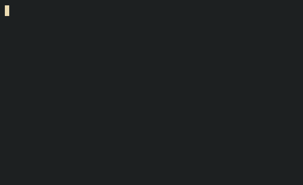
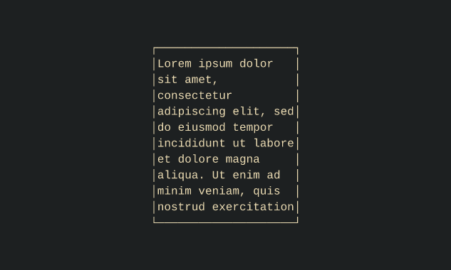

Navigation
==========

Functui uses the :obj:`~functui.NavState` statefull component to manage mouse navigation data (and even keyboard navigation data if you want to use it)

Simple Mouse Example
--------------------

.. code-block:: python

    from functui import open_terminal, render_fit_terminal, Screen, NavState
    from functui.nodes import *

    # application state
    screen = Screen()
    nav = NavState()

    with open_terminal() as term:
        while True:

            # render

            layout = text("border will appear if this is hovered")\
                | (border if nav.is_hovered("button") else empty)\
                | hoverable("button")\
                | center\

            result = render_fit_terminal(term, screen, layout)

            # wait

            event = term.wait_for_input()

            # update

            if event.key_event == "ctrl+c":
                break # exit program

            # IMPORTANT: don't forget to update the NavState object!
            nav.update(result, event)

Explanation
-----------
A :func:`~functui.nodes.hoverable` wrapper node is used to declare a node as hoverable. A unique node id must be passed into ``hoverable`` which is referenced in the :func:`~functui.NavState.is_hovered` method of :obj:`~functui.NavState` to check whether the node is hovered or not.

The :obj:`~functui.NavState` must be updated every frame with the :obj:`~functui.NavState.update` method to keep the navigation state relevant.

Vertical Scroll
---------------

The :obj:`~functui.NavState` component can also be used to created some 

